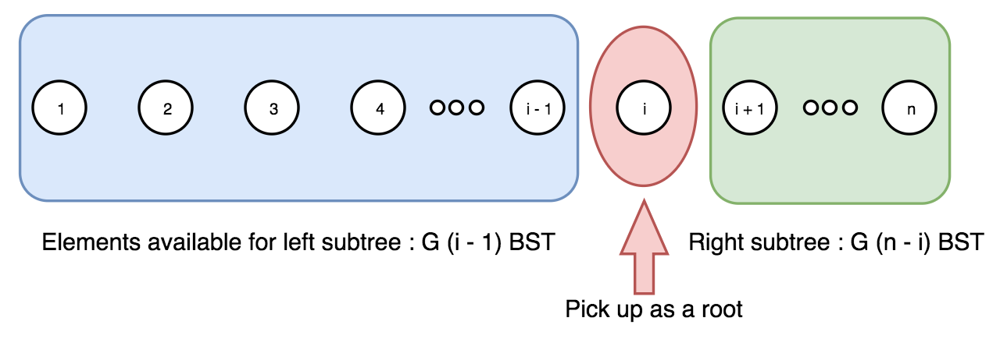

# 特殊的算法

## 1.卡特兰数

### 概述

**来源**：*卡特兰数*又称卡塔*兰数*，*卡特兰数*是组合数学中一个常出现在各种计数问题中的数列。

**原理**：设h(n)为catalan数的第n+1项，令h(0)=1,h(1)=1，catalan数满足递推式 [2] ：

**h(n)= h(0)\*h(n-1)+h(1)\*h(n-2) + ... + h(n-1)\*h(0) (n>=2)**

例如：h(2)=h(0)\*h(1)+h(1)*h(0)=1\*1+1\*1=2

h(3)=h(0)\*h(2)+h(1)\*h(1)+h(2)\*h(0)=1\*2+1\*1+2\*1=5

另类递推式：

**h(n)=h(n-1)\*(4\*n-2)/(n+1);**

递推关系的解为：

**h(n)=C(2n,n)/(n+1) (n=0,1,2,...)**

递推关系的另类解为：

**h(n)=c(2n,n)-c(2n,n-1)(n=0,1,2,...)**

例题：**括号化**、**出栈次序**、

### 相关题目

#### [95.不同的二叉搜索树 II](./95.不同的二叉搜索树-ii.cpp)

递归，首先来计数需要构建的二叉树数量。可能的二叉搜素数数量是一个 **卡特兰数**。

算法，我们从序列 1 ..n 中取出数字 i，作为当前树的树根。于是，剩余 i - 1 个元素可用于左子树，n - i 个元素用于右子树。这样会产生 G(i - 1) 种左子树 和 G(n - i) 种右子树，其中 G 是卡特兰数。



现在，我们对序列 1 ... i - 1 重复上述过程，以构建所有的左子树；然后对 i + 1 ... n 重复，以构建所是有的右子树。

这样，我们就有了树根 i 和可能的左子树、右子树的列表。

最后一步，对两个列表循环，将左子树和右子树连接在根上。

## 2.二叉树的遍历算法

二叉树遍历是二叉树的最基本的操作，其实现方式主要有三种：

1. 递归遍历
2. 非递归遍历
3. Morris遍历

递归遍历的实现非常容易，非递归实现需要用到栈。而Morris算法可能很多人都不太熟悉，其强大之处在于只需要使用O(1)的空间就能实现对二叉树O(n)时间的遍历。

### 二叉树结点的定义

每个二叉树结点包括一个值以及左孩子和右孩子结点，其定义如下：

```
class TreeNode {
    public:
        int val;
        TreeNode *left, *right;
        TreeNode(int val) {
            this->val = val;
            this->left = this->right = NULL;
        }   
};
```

### 二叉树的遍历

二叉树的遍历，就是按照某条搜索路径访问树中的每一个结点，使得每个结点均被访问一次，而且仅被访问一次。常见的遍历次序有：

1. 先序遍历：先访问根结点，再访问左子树，最后访问右子树
2. 中序遍历：先访问左子树，再访问根结点，最后访问右子树
3. 后序遍历：先访问左子树，再访问右子树，最后访问根结点

下面介绍，二叉树3种遍历方式的实现。

### 递归遍历

递归实现非常简单，按照遍历的次序，对当前结点分别调用左子树和右子树即可。

#### 前序遍历

```
void preOrder(TreeNode *root) {
    if(root == NULL)
        return;
    cout << root->val << endl;
    preOrder(root->left);
    preOrder(root->right);
}
```

#### 中序遍历

```
void inOrder(TreeNode *root) {
    if(root == NULL)
        return;
    inOrder(root->left);
    cout << root->val << endl;
    inOrder(root->right);
}
```

#### 后序遍历

```
void postOrder(TreeNode *root) {
    if(root == NULL)
        return;
    postOrder(root->left);
    postOrder(root->right);
    cout << root->val << endl;
}
```

#### 复杂度分析

二叉树遍历的递归实现，每个结点只需遍历一次，故时间复杂度为O(n)。而使用了递归，最差情况下递归调用的深度为O(n)，所以空间复杂度为O(n)。

### 非递归遍历

二叉树遍历的非递归实现，可以借助栈。

#### 前序遍历

1. 将根结点入栈；
2. 每次从栈顶弹出一个结点，访问该结点；
3. 把当前结点的右孩子入栈；
4. 把当前结点的左孩子入栈。

按照以上顺序入栈，这样出栈顺序就与先序遍历一样：先根结点，再左子树，最后右子树。

```
void preOrder2(TreeNode *root) {
    if(root == NULL)
        return;

    stack<TreeNode *> stk;
    stk.push(root);                                                                                                                                                                            
    while(!stk.empty()) {
        TreeNode *pNode = stk.top();
        stk.pop();
        cout << pNode->val << endl;
        if(pNode->right != NULL)
            stk.push(pNode->right);
        if(pNode->left != NULL)
            stk.push(pNode->left);
    }
}
```

#### 中序遍历

1. 初始化一个二叉树结点pNode指向根结点；
2. 若pNode非空，那么就把pNode入栈，并把pNode变为其左孩子；（直到最左边的结点）
3. 若pNode为空，弹出栈顶的结点，并访问该结点，将pNode指向其右孩子（访问最左边的结点，并遍历其右子树）

```
void inOrder2(TreeNode *root) {
    if(root == NULL)
        return;

    stack<TreeNode *> stk;
    TreeNode *pNode = root;
    while(pNode != NULL || !stk.empty()) {
        if(pNode != NULL) {
            stk.push(pNode);
            pNode = pNode->left;
        }
        else {
            pNode = stk.top();
            stk.pop();
            cout << pNode->val << endl;
            pNode = pNode->right;
        }
    }
}
```

#### 后序遍历

1. 设置两个栈stk, stk2；
2. 将根结点压入第一个栈stk；
3. 弹出stk栈顶的结点，并把该结点压入第二个栈stk2；
4. 将当前结点的左孩子和右孩子先后分别入栈stk；
5. 当所有元素都压入stk2后，依次弹出stk2的栈顶结点，并访问之。

第一个栈的入栈顺序是：根结点，左孩子和右孩子；于是，压入第二个栈的顺序是：根结点，右孩子和左孩子。因此，弹出的顺序就是：左孩子，右孩子和根结点。

```
void postOrder2(TreeNode *root) {
    if(root == NULL)
        return;

    stack<TreeNode *> stk, stk2;
    stk.push(root);
    while(!stk.empty()) {
        TreeNode *pNode = stk.top();
        stk.pop();
        stk2.push(pNode);
        if(pNode->left != NULL)
            stk.push(pNode->left);
        if(pNode->right != NULL)
            stk.push(pNode->right);
    }
    while(!stk2.empty()) {
        cout << stk2.top()->val << endl;
        stk2.pop();
    }
}
```

另外，二叉树的后序遍历的非递归实现，也可以只使用一个栈来实现。

```
void postOrder2(TreeNode *root) {
    if(root == NULL)
        return;

    stack<TreeNode *> stk;
    stk.push(root);
    TreeNode *prev = NULL;
    while(!stk.empty()) {
        TreeNode *pNode = stk.top();
        if(!prev || prev->left == pNode || prev->right == pNode) {  // traverse down
            if(pNode->left)
                stk.push(pNode->left);
            else if(pNode->right)
                stk.push(pNode->right);

         /* else {
                cout << pNode->val << endl;
                stk.pop();
            }
        */

        }
        else if(pNode->left == prev) {  // traverse up from left
            if(pNode->right)
                stk.push(pNode->right);
        }

    /* else if(pNode->right == prev) { // traverse up from right
                cout << pNode->val << endl;
                stk.pop();
        }
    */

        else {
            cout << pNode->val << endl;
            stk.pop();
        }
        prev = pNode;
    }
}
```

#### 复杂度分析

二叉树遍历的非递归实现，每个结点只需遍历一次，故时间复杂度为O(n)。而使用了栈，空间复杂度为二叉树的高度，故空间复杂度为O(n)。

### Morris遍历

Morris遍历算法最神奇的地方就是，只需要常数的空间即可在O(n)时间内完成二叉树的遍历。O(1)空间进行遍历困难之处在于在遍历的子结点的时候如何重新返回其父节点？在Morris遍历算法中，通过修改叶子结点的左右空指针来指向其前驱或者后继结点来实现的。

#### 中序遍历

1. 如果当前结点pNode的左孩子为空，那么输出该结点，并把该结点的右孩子作为当前结点；
2. 如果当前结点pNode的左孩子非空，那么就找出该结点在中序遍历中的前驱结点pPre
   - 当第一次访问该前驱结点pPre时，其右孩子必定为空，那么就将其右孩子设置为当前结点，以便根据这个指针返回到当前结点pNode中，并将当前结点pNode设置为其左孩子；
   - 当该前驱结点pPre的右孩子为当前结点，那么就输出当前结点，并把前驱结点的右孩子设置为空（恢复树的结构），将当前结点更新为当前结点的右孩子
3. 重复以上两步，直到当前结点为空。

```
void inOrder3(TreeNode *root) {
    if(root == NULL)
        return;

    TreeNode *pNode = root;
    while(pNode != NULL) {
        if(pNode->left == NULL) {
            cout << pNode->val << endl;
            pNode = pNode->right;
        }
        else {
            TreeNode *pPre = pNode->left;
            while(pPre->right != NULL && pPre->right != pNode) {
                pPre = pPre->right;
            }

            if(pPre->right == NULL) {
                pPre->right = pNode;
                pNode = pNode->left;
            }
            else {
                pPre->right = NULL;
                cout << pNode->val << endl;
                pNode = pNode->right;
            }
        }
    }
}
```

因为只使用了两个辅助指针，所以空间复杂度为O(1)。对于时间复杂度，每次遍历都需要找到其前驱的结点，而寻找前驱结点与树的高度相关，那么直觉上总的时间复杂度为O(nlogn)。其实，并不是每个结点都需要寻找其前驱结点，只有左子树非空的结点才需要寻找其前驱，所有结点寻找前驱走过的路的总和至多为一棵树的结点个数。因此，整个过程每条边最多走两次，一次使定位到该结点，另一次是寻找某个结点的前驱，所以时间复杂度为O(n)。

如以下一棵二叉树。首先，访问的是根结点F，其左孩子非空，所以需要先找到它的前驱结点（寻找路径为B->D->E），将E的右指针指向F，然后当前结点为B。依然需要找到B的前驱结点A，将A的右指针指向B，并将当前结点设置为A。下一步，输出A，并把当前结点设置为A的右孩子B。之后，会访问到B的前驱结点A指向B，那么令A的右指针为空，继续遍历B的右孩子。依次类推。 

#### 前序遍历

与中序遍历类似，区别仅仅是输出的顺序不同。

```
void preOrder3(TreeNode *root) {
    if(root == NULL)
        return;
    TreeNode *pNode = root;
    while(pNode) {
        if(pNode->left == NULL) {
            cout << pNode->val << endl;
            pNode = pNode->right;
        }   
        else {
            TreeNode *pPre = pNode->left;
            while(pPre->right != NULL && pPre->right != pNode)
                pPre = pPre->right;

            if(pPre->right == NULL) {
                pPre->right = pNode;
                cout << pNode->val << endl;
                pNode = pNode->left;
            }   
            else {
                pPre->right = NULL;
                pNode = pNode->right;
            }   
        }   
    }   
}
```

#### 后序遍历

1. 先建立一个临时结点dummy，并令其左孩子为根结点root，将当前结点设置为dummy；
2. 如果当前结点的左孩子为空，则将其右孩子作为当前结点；
3. 如果当前结点的左孩子不为空，则找到其在中序遍历中的前驱结点
   - 如果前驱结点的右孩子为空，将它的右孩子设置为当前结点，将当前结点更新为当前结点的左孩子；
   - 如果前驱结点的右孩子为当前结点，倒序输出从当前结点的左孩子到该前驱结点这条路径上所有的结点。将前驱结点的右孩子设置为空，将当前结点更新为当前结点的右孩子。
4. 重复以上过程，直到当前结点为空。

```
void reverse(TreeNode *p1, TreeNode *p2) {
    if(p1 == p2) 
        return;
    TreeNode *x = p1; 
    TreeNode *y = p1->right;
    while(true) {
        TreeNode *temp = y->right;
        y->right = x;
        x = y;
        y = temp;
        if(x == p2) 
            break;
    }   
}

void printReverse(TreeNode *p1, TreeNode *p2) {
    reverse(p1, p2);

    TreeNode *pNode = p2; 
    while(true) {
        cout << pNode->val << endl;
        if(pNode == p1) 
            break;
        pNode = pNode->right;
    }   

    reverse(p2, p1);
}

void postOrder3(TreeNode *root) {
    if(root == NULL)
        return;

    TreeNode *dummy = new TreeNode(-1);
    dummy->left = root;
    TreeNode *pNode = dummy;
    while(pNode != NULL) {
        if(pNode->left == NULL)
            pNode = pNode->right;
        else {
            TreeNode *pPrev = pNode->left;
            while(pPrev->right != NULL && pPrev->right != pNode)
                pPrev = pPrev->right;

            if(pPrev->right == NULL) {
                pPrev->right = pNode;
                pNode = pNode->left;
            }
            else {
                printReverse(pNode->left, pPrev);
                pPrev->right = NULL;
                pNode = pNode->right;
            }
        }
    }
}
```

